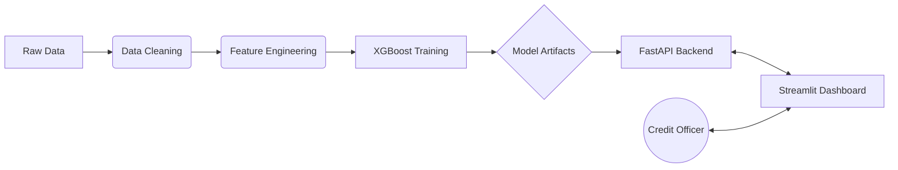
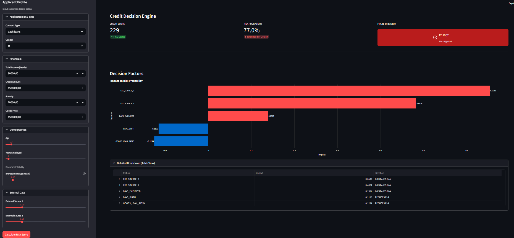
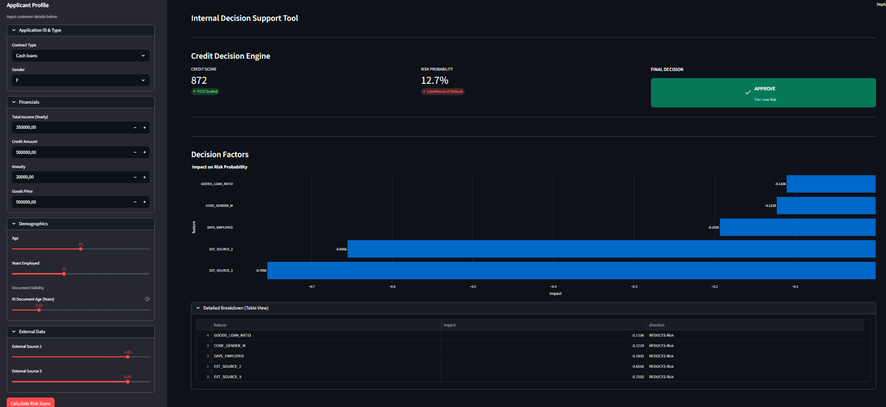
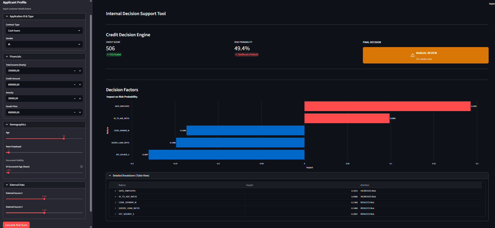
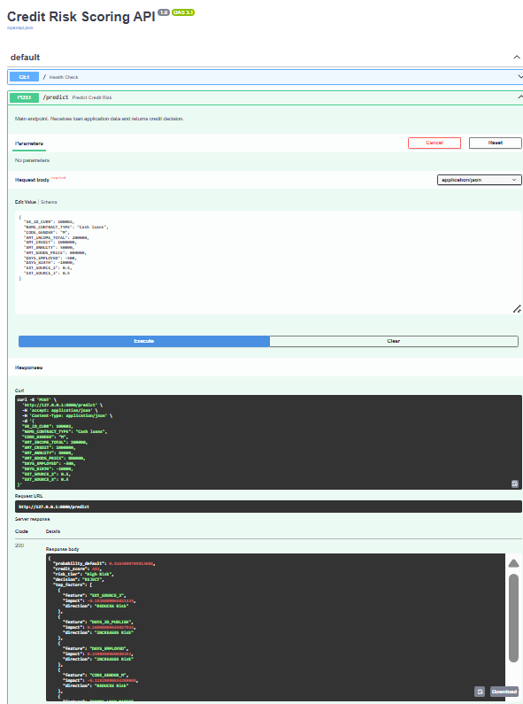

# 🏦 End-to-End Credit Risk Scoring System


## Project Overview

This project is a complete **End-to-End Credit Scoring Solution** designed to simulate a modern banking decision engine. It predicts the probability of loan default using machine learning and serves decisions via a real-time API and an interactive dashboard.

The system addresses the "Black Box" problem in finance by integrating **SHAP (Shapley Additive exPlanations)**, allowing Credit Officers to see exactly *why* an applicant was approved or rejected (e.g., "Low external score increased risk by 15%").

### Key Features
* **Robust Pipeline:** Automated Data Cleaning & Feature Engineering tailored for financial datasets.
* **Machine Learning Engine:** XGBoost Classifier optimized for imbalanced data (Scale Pos Weight), achieving **0.76 ROC-AUC**.
* **Microservice Architecture:** Model served via **FastAPI** for low-latency (<200ms) predictions.
* **Interactive Dashboard:** A professional **Streamlit** interface with MVC (Model-View-Controller) architecture.
* **Explainability:** Real-time SHAP visualization to interpret risk factors (Regulatory Compliance friendly).

---

## Architecture



---

## Project Demo

### 1. The Dashboard (Frontend)

**Scenario A: High Risk Applicant (REJECT)**
The model detects high-risk applicants based on poor external scores and high debt-to-income ratios. The SHAP chart (red bars) clearly visualizes the risk drivers.



**Scenario B: Low Risk Applicant (APPROVE)**
Ideal customers with stable employment and good credit history.



**Scenario C: Borderline Applicant (MANUAL REVIEW)**
The system flags medium-risk cases for human intervention, preventing auto-rejection of potential good customers.



### 2. The API (Backend)
The system exposes a RESTful API documented automatically via Swagger UI. It accepts JSON payloads and returns the Probability of Default (PD), Credit Score, and SHAP explanations.



---

## Tech Stack

* **Language:** Python 3.10+
* **Data Processing:** Pandas, NumPy
* **Machine Learning:** XGBoost, Scikit-Learn, Joblib
* **Explainability:** SHAP
* **API Framework:** FastAPI, Uvicorn, Pydantic
* **Frontend:** Streamlit, Altair (Charts)

---

## How to Run Locally

### 1. Clone the Repository
```bash
git clone https://github.com/your-username/credit-risk-scoring.git
cd credit-risk-scoring
```

### 2. Install Dependencies
It is recommended to use a virtual environment.
```bash
python -m venv venv
source venv/bin/activate  # On Windows: venv\Scripts\activate
pip install -r requirements.txt
```

### 3. Run the Backend (API)
The API will start at `http://127.0.0.1:8000`.
```bash
uvicorn app.api:app --reload
```
*Access API Docs at: [http://127.0.0.1:8000/docs](http://127.0.0.1:8000/docs)*

### 4. Run the Frontend (Dashboard)
Open a new terminal, activate venv, and run:
```bash
streamlit run app/dashboard.py
```
The dashboard will open automatically in your browser at `http://localhost:8501`.

---

## Project Structure

```text
credit-risk-scoring/
├── app/
│   ├── api.py           # FastAPI Backend & Endpoints
│   ├── dashboard.py     # Streamlit Controller
│   ├── services.py      # Business Logic Layer
│   ├── ui_components.py # UI/View Layer
│   └── assets.py        # Static Assets (SVG Icons)
├── data/
│   ├── raw/             # Initial Dataset (application_train.csv)
│   ├── processed/       # Cleaned Parquet files
│   └── models/          # Trained Model (.joblib) & Metadata
├── src/
│   ├── data_cleaning.py       # Cleaning Pipeline
│   ├── feature_engineering.py # Financial Ratios Creation
│   ├── training.py            # Model Training Script
│   └── inference.py           # Prediction Logic + SHAP Engine
├── images/              # Demo Screenshots
├── requirements.txt
└── README.md
```

## Model Performance
* **Metric:** ROC-AUC
* **Score:** 0.7604
* **Recall (Default Class):** 69%
* **Strategy:** Cost-Sensitive Learning (Scale Pos Weight) to handle 92:8 class imbalance.

---

### Author
Developed by **Fernando Kurniawan**.